## 懸案事項

### 室内監視の案

* 家でatomか何かでwebsocketを監視しambientに送信する
* [ambient](https://ambidata.io/)でグラフ表示と公開
* co2参照の参考
  * https://gist.github.com/YujiSoftware/9274366a93f1ac7f9208bd4abf096527
* 他の監視する対象案は?
  * 二酸化炭素の精度をあげる → [MH-Z19B](https://kitto-yakudatsu.com/archives/7286)
  * [音センサー](https://jp.seeedstudio.com/Grove-Light-Sensor-v1-2-LS06-S-phototransistor.html)
  * [ダストセンサー](https://jp.seeedstudio.com/Grove-Dust-Sensor-PPD42NS.html)
  * [騒音センサー](https://jp.seeedstudio.com/Grove-Loudness-Sensor-p-1493.html)

### GR-ROSEでBEZERRYを動かす

* ユースケース
  * お客様が来社して、呼び出す人を指名
  * 呼びされた人はお客様の顔を確認し
    * 対応ボタンを押すと、ロボがちょっと待ってね
    * 対応拒否ボタンを押すと、ロボがごめんなさいする
    * 画像の置き場は固定で、通知がきたらそれを取りに行く仕組みでもよいかも
* bezzeryの動き自体はgr-roseのサーボ機能
* 音声のしゃべらせ方は  → wavファイルつくって
  * [【Arduino】WAVまたはMP3ファイルを再生する](https://nn-hokuson.hatenablog.com/entry/2017/09/01/092945)
* 人の検出はunitV(m5stickV)
  * [AIカメラ“M5StickV”で会議室の人数を数えてデータを可視化](https://eng-blog.iij.ad.jp/archives/8424)
  * データの送信はUARTで実現している
* 写真をとるのもunitV(m5stickV)
  * [M5StickVをデジカメにしてみた。](https://qiita.com/deckeye/items/dc27c3bbe7ae9e724c35)
  * GR-ROSEへの転送はどうする? → [Wi-FiがないM5StickVを、M5StickCと繋ぎLINEに投稿してみるまでの手順](https://qiita.com/nnn112358/items/5efd926fea20cd6c2c43)
* M5Paperで候補の人のリストを表示し、呼び出したい人を押させる
  * [m5paperでUART通信した話](http://setsubi.no-mania.com/m5paper/m5paper%E3%81%A7uart%E9%80%9A%E4%BF%A1%E3%81%97%E3%81%9F%E8%A9%B1)
* azureとの通信方法は?
  * [簡単Azure IoT接続！～32bit MCU RX65NがAzure RTOSに対応～](https://www.renesas.com/us/ja/blogs/easy-azure-iot-connection-rx65n-32bit-mcu-supports-azure-rtos)
  * [RX65NでAzureRTOSを使ってみる](https://qiita.com/kei-606/items/63907512b9cf812ca4d3)
  * キーワードは「cloud to device」?

### UARTの知識
  * [UART　その１　基本](http://www.ele-lab.com/tips_uart.html)
  * [UART　その２　基本](http://www.ele-lab.com/tips_uart2.html)

### おまけ
  * [M5Stack Core 2で始めるAzure IoT Hub入門（その４）](https://hatsune.hatenablog.jp/entry/2021/09/06/203424) ここで止まってしまっている
  * [AzureIoTHub git](https://github.com/Azure/azure-iot-arduino) esp32でAzureを使うには
  * [ルネサス RX65N での FreeertOS OTA デモのダウンロード、ビルド、フラッシュ、実行](https://docs.aws.amazon.com/ja_jp/freertos/latest/userguide/download-rx65n-ota.html) RX65NでRTOSのOTA
  * [Web アプリで Azure IoT Hub からのリアルタイム センサー データを視覚化する](https://docs.microsoft.com/ja-jp/azure/iot-hub/iot-hub-live-data-visualization-in-web-apps) Azureのチュートリアル

## HEROZリーグ

### 鉄道運行情報

* [鉄道運行情報（レスキューナウ）](https://docs.ekispert.com/v1/api/operationLine/service/rescuenow/information.html) 通勤区間が駄目になっているかを表示する - べた過ぎる
