## システム概要

## 選択したハードウェア

* [ATOM CANBus Kit](https://shop.m5stack.com/products/atom-canbus-kit-ca-is3050g?_pos=3&_sid=f1f66c240&_ss=r)
* [CAT-M](https://shop.m5stack.com/collections/m5stack-new-arrival/products/sim7080g-cat-m-nb-iot-unit?variant=40493802160300)
* [300MBパック (IoT SIM plan-D D-300MB)](https://soracom.jp/store/13380/)
* [さくらのVPS](https://vps.sakura.ad.jp/)

## 候補となったハードウェア

* M5Stack
* [CAT-M](https://shop.m5stack.com/collections/m5stack-new-arrival/products/sim7080g-cat-m-nb-iot-unit?variant=40493802160300)
* CANモジュール以下のうちいずれか一つ
    * [COMMU Module](https://shop.m5stack.com/products/commu-module?_pos=1&_sid=f1f66c240&_ss=r)
    * [ATOM CANBus Kit](https://shop.m5stack.com/products/atom-canbus-kit-ca-is3050g?_pos=3&_sid=f1f66c240&_ss=r)
    * [CANBus Unit](https://shop.m5stack.com/products/canbus-unitca-is3050g?_pos=2&_sid=f1f66c240&_ss=r)

